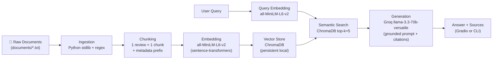

# Project 1 Planning: The Unofficial Guide

> Write this document before you write any pipeline code.
> Your spec and architecture diagram are what you'll use to direct AI tools (Claude, Copilot, etc.) to generate your implementation — the more specific they are, the more useful the generated code will be.
> Update the Retrieval Approach and Chunking Strategy sections if you change your approach during implementation.
> Update this file before starting any stretch features.

---

## Domain

Student reviews of CS professors at Virginia Tech. Official course catalogs and department websites describe what a class covers, but they do not tell you which professor gives useful exam feedback, whether TAs grade slowly, or if a section is an "easy A" versus a grind. This knowledge lives in scattered student reviews on Rate My Professors and Coursicle — hard to search across professors and courses at once.

---

## Documents

| # | Source | Description | URL or location |
|---|--------|-------------|-----------------|
| 1 | Rate My Professors | John Lewis — CS1064 intro Python (75 ratings, highly recommended) | `documents/john_lewis_rmp.txt` · https://www.ratemyprofessors.com/professor/2453636 |
| 2 | Rate My Professors | Mohammed Farghally — CS2114/CS3114 (projects, test retakes) | `documents/mohammed_farghally_rmp.txt` · https://www.ratemyprofessors.com/professor/2657788 |
| 3 | Rate My Professors | Margaret Ellis — CS2104/CS2114 (polarized reviews, TA grading) | `documents/margaret_ellis_rmp.txt` · https://www.ratemyprofessors.com/professor/2049285 |
| 4 | Rate My Professors | Chris Thomas — graduate ML/computer vision (hard but rewarding) | `documents/chris_thomas_rmp.txt` · https://www.ratemyprofessors.com/professor/2891584 |
| 5 | Rate My Professors | Amun Kharel — CS3724 Intro to HCI (engaging, flexible) | `documents/amun_kharel_rmp.txt` · https://www.ratemyprofessors.com/professor/3052333 |
| 6 | Rate My Professors | Anuj Karpatne — CS5525 grad ML (caring but heavy workload) | `documents/anuj_karpatne_rmp.txt` · https://www.ratemyprofessors.com/professor/2722388 |
| 7 | Rate My Professors | Richard Charles — CS2304 SQL elective (easy 1-credit) | `documents/richard_charles_rmp.txt` · https://www.ratemyprofessors.com/professor/2832708 |
| 8 | Rate My Professors | Shaddi Hasan — grad courses, strong feedback | `documents/shaddi_hasan_rmp.txt` · https://www.ratemyprofessors.com/professor/2779797 |
| 9 | Rate My Professors | Heath Hillman — intro courses (polarized, sarcastic style) | `documents/heath_hillman_rmp.txt` · https://www.ratemyprofessors.com/professor/2861248 |
| 10 | Coursicle | CS1064 course page — cross-professor comparison (93 reviews) | `documents/cs1064_coursicle.txt` · https://www.coursicle.com/vt/courses/CS/1064/ |
| 11 | Coursicle | CS2114 course page — Ellis vs Farghally vs Hillman (91 reviews) | `documents/cs2114_coursicle.txt` · https://www.coursicle.com/vt/courses/CS/2114/ |

---

## Chunking Strategy

**Chunk size:** One review per chunk (structural chunking, not fixed character count). Typical chunk: 200–600 characters including a metadata prefix. Fallback for unusually long text (>800 characters): split with a 512-character window and 64-character overlap.

**Overlap:** 0 overlap between review chunks under normal conditions. Each chunk is self-contained. Instead of character overlap, every chunk gets a repeated metadata prefix (~120 characters): professor name, course code, source site, and source file/URL. This ensures a retrieved chunk is attributable and searchable even when the review body is only 1–2 sentences.

**Reasoning:**

Documents are short, opinion-based reviews — not long guides. A fixed 500-character split would either merge unrelated reviews (e.g., Farghally's CS2114 retake policy bundled with CS3114 project advice) or cut mid-sentence (e.g., splitting "Free test retakes are incredible" from the rest of the review that explains why).

**Why one review = one chunk fits this corpus:**

- RMP files are already structured with `Course: … | Review: …` blocks separated by blank lines. Each block is 1–4 sentences with a single opinion.
- Coursicle files mix a course description with individual professor reviews. The description becomes one chunk; each `Professor: … | Review: …` block becomes its own chunk.
- Key facts (test retakes, 10% early bonus, TA grading delays) live in a single sentence inside one review. Keeping the whole review intact preserves retrievability.

**What too small looks like:** Splitting a review into sentence-level chunks loses context — "Free test retakes are incredible" alone does not identify the professor or course. Retrieval would return orphan sentences the LLM cannot attribute.

**What too large looks like:** Chunking an entire professor page (~2,000+ characters, 5 reviews) dilutes embedding signal. A query about CS3114 project advice might rank below unrelated CS2114 content in the same chunk, or the embedding would average conflicting opinions into one vector.

**Preprocessing before chunking:**

1. Strip RMP/Coursicle boilerplate already removed during collection (footer text, "Load More Ratings").
2. Parse structured fields (professor, course, date, review text) from each file.
3. Attach metadata prefix to every chunk body before embedding.

**Expected final chunk count:** ~55 chunks across 11 documents (≈5 reviews per RMP file × 9 files, plus ~2–4 chunks per Coursicle file including the course description).

---

## Retrieval Approach

**Embedding model:** `all-MiniLM-L6-v2` via `sentence-transformers` (384-dimensional embeddings, runs locally, no API key).

**Top-k:** 5 chunks per query.

**Why top-k = 5:**

- Corpus is small (~55 chunks), so retrieving too many (k=10+) would return nearly half the database and add noise.
- k=5 is enough to surface multiple reviews for comparison questions (e.g., Ellis vs. Farghally for CS2114) while staying within the LLM context window.
- k=2–3 risks missing a second confirming review or a contrasting opinion for polarized professors.

**Why semantic search works here:** Embeddings capture meaning, not exact words. A query like "professor who gives useful feedback on exams" can match a review saying "His feedbacks are awesome" even though the words differ — both map to similar vectors in embedding space.

**Production tradeoff reflection:** If cost were not a constraint, I would weigh:

- **Accuracy on informal text:** Larger models like `e5-large-v2` or OpenAI `text-embedding-3-large` handle slang and domain jargon better than MiniLM, which was trained on general web text.
- **Context length:** Review chunks are short, so MiniLM's 256-token limit is sufficient today — but a production system ingesting full Reddit threads would need models supporting 512+ tokens.
- **Multilingual support:** VT has international students; `multilingual-e5-large` would help if we added reviews in other languages. MiniLM is English-centric.
- **Latency vs. local hosting:** MiniLM runs on CPU in ~50 ms per query — fine for a demo. A hosted API (Cohere, OpenAI) adds network latency but scales to millions of chunks without local GPU.
- **Metadata-aware retrieval:** Production systems often combine dense embeddings with BM25 keyword search (stretch feature) so course codes like "CS2114" match exactly even when semantic similarity is weak.

---

## Evaluation Plan

| # | Question | Expected answer |
|---|----------|-----------------|
| 1 | Which professor do student reviews most recommend for CS1064, and how many hours per week do they say they spend on coursework outside of class? | John Lewis. Reviews say CS1064 is not very difficult if you spend roughly 1–3 hours outside of class to understand the content; Lewis is praised for clear assignments, accessibility, and giving everyone 100s on a final quiz after a snow day. |
| 2 | Does Mohammed Farghally offer test retakes in CS2114 or CS3114? | Yes. Multiple reviews explicitly state he offers free test retakes. CS3114 reviews also mention a 10% bonus for turning projects in early. |
| 3 | What specific grading complaint do students raise about Margaret Ellis's CS2114 section? | Students report that TAs grade very slowly — grades can drop from an A to a B-/C+ over several weeks. Negative reviews also cite heavy classwork/homework volume and unclear instructions. |
| 4 | Is Chris Thomas's CS5814 or CS5864 class an easy A? | No. Reviews describe the courses as math-heavy with intense exams and homework (difficulty ratings of 4–5/5). Students note he bell-curves generously and gives extra credit, but explicitly say "if you want easy A take someone else." |
| 5 | How many reports are assigned in Amun Kharel's CS3724 (Intro to HCI), and is attendance mandatory? | 4 group reports and 1 personal report. Reviews state attendance is mandatory in some sections and Kharel is flexible with extensions. |

---

## Anticipated Challenges

1. **Polarized reviews for the same professor** — Margaret Ellis and Heath Hillman have both glowing and harsh reviews. Retrieval may return only one side, causing the LLM to overstate a single opinion. Per-review chunking helps surface both sides, but the generator must synthesize conflicting evidence rather than pick one.

2. **Short, informal review text** — Reviews use slang ("goated," "my goat") and abbreviations. The embedding model may not reliably match queries like "who gives good feedback" to reviews that say "feedbacks are awesome." The metadata prefix on each chunk (professor + course + source) mitigates attribution failures.

3. **Duplicate reviews across sources** — The same Farghally CS2114 review appears on both Rate My Professors and Coursicle. Top-k retrieval may return near-identical chunks, wasting context slots and making the system appear more confident than the evidence supports. Deduplication by review text hash during ingestion is a possible fix.

4. **Course-level vs. professor-level queries** — A question like "best CS2114 professor" requires comparing chunks from different professor files. No single chunk contains a ranked list; the LLM must synthesize across retrieved chunks. If retrieval returns mostly Ellis reviews (more total ratings), the answer may skew negative even if Farghally is better-liked in the corpus.

---

## Architecture

**Stage summary:**

| Stage | Tool / Library | Output |
|-------|---------------|--------|
| Document Ingestion | Python (`pathlib`, regex parsing) | Structured review records with metadata |
| Chunking | Custom `chunk_documents()` | ~55 self-contained chunks with prefix |
| Embedding | `sentence-transformers` (`all-MiniLM-L6-v2`) | 384-dim vectors per chunk |
| Vector Store | ChromaDB (persistent `./chroma_db/`) | Searchable index with metadata fields |
| Retrieval | ChromaDB cosine similarity, k=5 | Top 5 relevant chunks + source metadata |
| Generation | Groq API (`llama-3.3-70b-versatile`) | Grounded answer citing source file/URL |

---

## AI Tool Plan

**Milestone 3 — Ingestion and chunking:**

- **Tool:** Claude (Cursor agent)
- **Input:** This document's Chunking Strategy, Documents table, Architecture diagram, and one sample file (`documents/mohammed_farghally_rmp.txt`) showing the expected parse format
- **Expected output:** `ingest.py` (load and parse `.txt` files from `documents/`) and `chunk.py` (split into one-review-per-chunk with metadata prefix). A `build_index.py` or `main.py` entry point that prints total chunk count.
- **Verification:** Run the script and confirm ~55 chunks. Manually inspect 3 chunks: each must contain professor name, course code, review text, and source URL. Confirm no review is split across two chunks.

**Milestone 4 — Embedding and retrieval:**

- **Tool:** Claude (Cursor agent)
- **Input:** Retrieval Approach section, Architecture diagram, `requirements.txt` dependencies, and the chunk output format from Milestone 3
- **Expected output:** `embed.py` (embed chunks with `all-MiniLM-L6-v2`, store in ChromaDB with metadata: `professor`, `course`, `source`, `source_url`, `chunk_id`) and `retrieve.py` (accept a query string, return top-5 chunks with similarity scores)
- **Verification:** Run 3 manual retrieval tests before adding generation: (1) "CS1064 John Lewis" should return Lewis reviews; (2) "test retakes Farghally" should return Farghally CS2114 chunks; (3) "easy A Chris Thomas" should return Thomas reviews mentioning difficulty. If any test returns off-target chunks, adjust metadata prefix or k before proceeding.

**Milestone 5 — Generation and interface:**

- **Tool:** Claude (Cursor agent)
- **Input:** Evaluation Plan (5 questions), Architecture diagram, project README Grounded Generation requirements, and `.env.example` for Groq API key setup
- **Expected output:** `generate.py` (system prompt enforcing grounding-only answers with source citations; refuse to answer if context is insufficient), plus a query interface (`app.py` using Gradio or a CLI script). System prompt must instruct the model to cite professor name + source file for every claim.
- **Verification:** Run all 5 evaluation questions through the full pipeline. Compare system responses against the Expected answer column. Document retrieval quality and response accuracy in README. At least one result should be partially accurate or inaccurate — if all five are perfect, add a harder question (e.g., "Should I take Heath Hillman for CS2114?") that forces synthesis of conflicting reviews.
